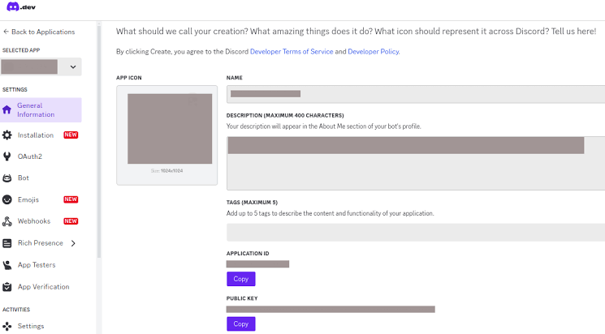

# Installation
```
git clone https://github.com/TiyoNotFound/NodeDICSA-MP.git
```
```
cd DIC
npm install
```
# Configuration
The configuration file is config.json.
Copy the Application ID of your bot.


# Initilization 
```
pm2 start index.js --name "app-name"
pm2 save
```
# Other Commands
```
pm2 start yourappname
pm2 stop yourappname
pm2 restart yourappname
```
